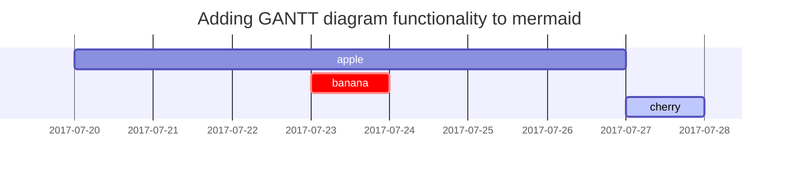

## 서론

본 포스팅에서는 **SHE(Somewhat Practical Fully Homomorphic Encryption)** 을 만족하는 **FV Scheme** 에 대해 설명 하고, 이러한 **FV Scheme** 을 어떻게 **FHE(Fully Homomorphic Encryption** 으로 전환할 수 있는 지 설명 하도록 하겠습니다.

## Basic Notation

$$
\begin{equation}
R= \mathbb{Z}[x]/(f(x)),\;f(x)∈\mathbb{Z}[x]\nonumber
\end{equation}
$$


기본적으로 FV 는 **RLWE** 기반으로 동작합니다. 즉, **다항식 Ring** 위에서 동작합니다.


$$
\begin{equation}
f(x) = x^d + 1 \quad with \quad d= 2^n \nonumber
\end{equation}
$$


일반적으로 f(x) 는 위와 같은 cyclotomic polynomial 으로 설정합니다.


$$
\begin{equation}
  \mathbf{a} ∈R ,\quad \mathbf{a}=\sum_{i=0}^{d-1}a_i \cdot x^i\nonumber
\end{equation}
$$


**R** 의 원소는 이 굵은 소문자로 표시합니다.


$$
\begin{gather}
||\mathbf{a}||\;\; is\;defined\;as\;\; max_i|a_i|\nonumber\\
δ_R = max\{||\mathbf{a}·\mathbf{b}||/(||\mathbf{a}||·||\mathbf{b}||):\mathbf{a},\mathbf{b} ∈R\}\nonumber
\end{gather}
$$


첫번째 식은 다항식 **a** 의 계수 중 가장 큰 계수를 나타냅니다. 그리고 `δR` 은 곱셈 연산으로 인해 다항식의 크기가 얼마나 증가하는 지 나타내는 **확장 계수**를 의미 합니다. 예를 들어 보겠습니다.


$$
\begin{gather}
\mathbf{a} = 1+2x+x^2,\;\mathbf{b} = 1+3x+x^2,\;\mathbf{ab}=1+5x+8x^2+5x^3+x^4 \nonumber\\
δ_R = max\{||\mathbf{a}·\mathbf{b}||/(||\mathbf{a}||·||\mathbf{b}||)\} = \frac{8}6\nonumber
\end{gather}
$$


이러한 확장 계수는 추후 노이즈의 범위를 정의하는 데 사용됩니다.


$$
\begin{gather}
\mathbb{Z}_q : the\;set\;of\;integers\;(-q/2,q/2],\;q>1\;be\;an\;integer\;
(not\;be\;confused\;with\;the\;ring\;\mathbb{Z}/q\mathbb{Z})\nonumber\\
\mathbf{R}_q : the\;set\;of\;polynomials\;in\;\mathbf{R}\;with\;coefficients\;in\;\mathbb{Z_q}\nonumber
\end{gather}
$$


위 식은 다항식 계수가 가질 수 있는 값의 범위를 제한합니다.


$$
\begin{gather}
[a]_q=a\;mod\;q\nonumber\\
r_q(a)=remainder\;modulo\;q\nonumber\\
⌊x⌉:\text{rounding to the nearest integer},\;x ∈\mathbb{R}\nonumber\\
⌊x⌋:\text{rounding down},\;x ∈\mathbb{R}\nonumber\\
⌈x⌉:\text{rounding up},\;x ∈\mathbb{R}\nonumber\\
size(n)=⌈log_2(n+ 0.5)⌉(bit\;size)\nonumber
\end{gather}
$$


마지막으로 단순 용어 정의입니다.

## Probability

### Ordered list

1. Firstly
2. Secondly
3. Thirdly

### Unordered list

- Chapter
  - Section
    - Paragraph

### ToDo list

- [ ] Job
  - [x] Step 1
  - [x] Step 2
  - [ ] Step 3

### Description list

Sun
: the star around which the earth orbits

Moon
: the natural satellite of the earth, visible by reflected light from the sun

## Block Quote

> This line shows the _block quote_.

## Prompts

<!-- markdownlint-capture -->
<!-- markdownlint-disable -->

> An example showing the `tip` type prompt.
> {: .prompt-tip }

> An example showing the `info` type prompt.
> {: .prompt-info }

> An example showing the `warning` type prompt.
> {: .prompt-warning }

> An example showing the `danger` type prompt.
> {: .prompt-danger }
> <!-- markdownlint-restore -->

## Tables

| Company                      | Contact          | Country |
| :--------------------------- | :--------------- | ------: |
| Alfreds Futterkiste          | Maria Anders     | Germany |
| Island Trading               | Helen Bennett    |      UK |
| Magazzini Alimentari Riuniti | Giovanni Rovelli |   Italy |


## Links

<http://127.0.0.1:4000>

## Footnote

Click the hook will locate the footnote[^footnote], and here is another footnote[^fn-nth-2].

## Inline code

This is an example of `Inline Code`.

## Filepath

Here is the `/path/to/the/file.extend`{: .filepath}.

## Code blocks

### Common

```text
This is a common code snippet, without syntax highlight and line number.
```

### Specific Language

```bash
if [ $? -ne 0 ]; then
  echo "The command was not successful.";
  #do the needful / exit
fi;
```

### Specific filename

```sass
@import
  "colors/light-typography",
  "colors/dark-typography";
```

{: file='_sass/jekyll-theme-chirpy.scss'}

## Mathematics

The mathematics powered by [**MathJax**](https://www.mathjax.org/):
$$
\begin{equation}
  \sum_{n=1}^\infty 1/n^2 = \frac{\pi^2}{6}
  \label{eq:series}
\end{equation}
$$

We can reference the equation as \eqref{eq:series}.

When $a \ne 0$, there are two solutions to $ax^2 + bx + c = 0$ and they are

$$ x = {-b \pm \sqrt{b^2-4ac} \over 2a} $$

## Mermaid SVG



## Images

### Default (with caption)

{: width="972" height="589" }
_Full screen width and center alignment_

### Left aligned

{: width="972" height="589" .w-75 .normal}

### Float to left

{: width="972" height="589" .w-50 .left}
Praesent maximus aliquam sapien. Sed vel neque in dolor pulvinar auctor. Maecenas pharetra, sem sit amet interdum posuere, tellus lacus eleifend magna, ac lobortis felis ipsum id sapien. Proin ornare rutrum metus, ac convallis diam volutpat sit amet. Phasellus volutpat, elit sit amet tincidunt mollis, felis mi scelerisque mauris, ut facilisis leo magna accumsan sapien. In rutrum vehicula nisl eget tempor. Nullam maximus ullamcorper libero non maximus. Integer ultricies velit id convallis varius. Praesent eu nisl eu urna finibus ultrices id nec ex. Mauris ac mattis quam. Fusce aliquam est nec sapien bibendum, vitae malesuada ligula condimentum.

### Float to right

{: width="972" height="589" .w-50 .right}
Praesent maximus aliquam sapien. Sed vel neque in dolor pulvinar auctor. Maecenas pharetra, sem sit amet interdum posuere, tellus lacus eleifend magna, ac lobortis felis ipsum id sapien. Proin ornare rutrum metus, ac convallis diam volutpat sit amet. Phasellus volutpat, elit sit amet tincidunt mollis, felis mi scelerisque mauris, ut facilisis leo magna accumsan sapien. In rutrum vehicula nisl eget tempor. Nullam maximus ullamcorper libero non maximus. Integer ultricies velit id convallis varius. Praesent eu nisl eu urna finibus ultrices id nec ex. Mauris ac mattis quam. Fusce aliquam est nec sapien bibendum, vitae malesuada ligula condimentum.

### Dark/Light mode & Shadow

The image below will toggle dark/light mode based on theme preference, notice it has shadows.

{: .light .w-75 .shadow .rounded-10 w='1212' h='668' }
{: .dark .w-75 .shadow .rounded-10 w='1212' h='668' }

## Video



## Reverse Footnote

[^footnote]: The footnote source
[^fn-nth-2]: The 2nd footnote source